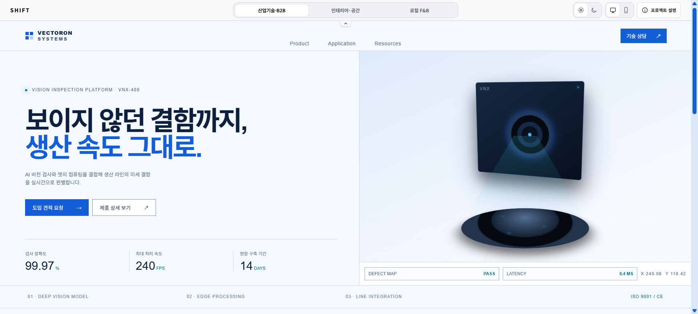
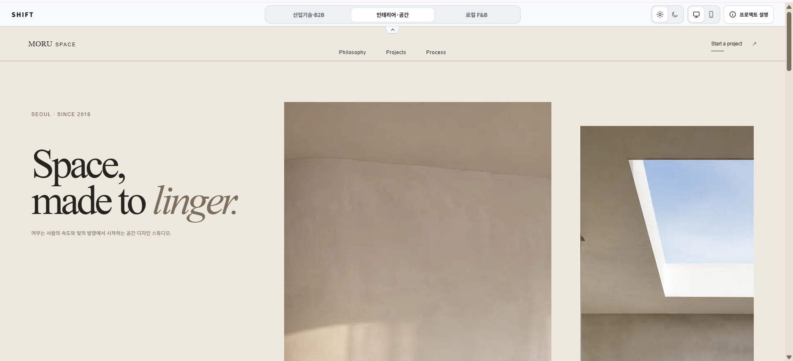
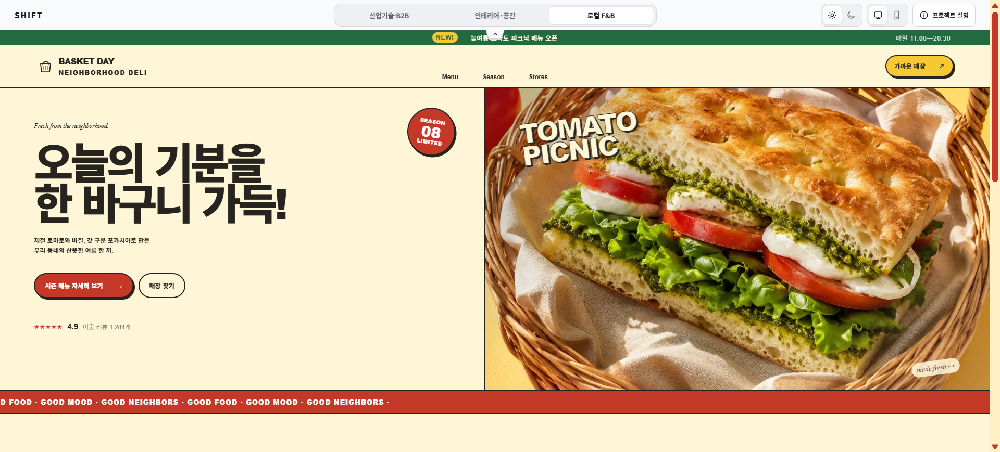
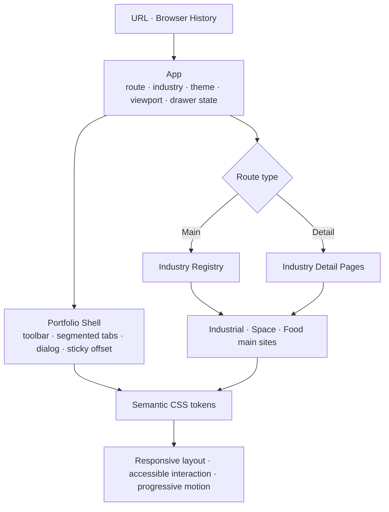

# SHIFT — AI 웹사이트 쇼케이스

> 하나의 제작 시스템으로, 서로 다른 세 업종의 목적과 사용 흐름을 설계했습니다.

[](https://react.dev/)
[](https://www.typescriptlang.org/)
[](https://vite.dev/)
[](https://vercel.com/)

[배포된 사이트 보기](https://shift-ai-website-showcase.vercel.app)

## 대표 화면

|                                               산업기술·B2B<br>VECTORON SYSTEMS                                                |                                          인테리어·공간<br>MORU SPACE                                           |                                             로컬 F&B<br>BASKET DAY DELI                                              |
| :---------------------------------------------------------------------------------------------------------------------------: | :------------------------------------------------------------------------------------------------------------: | :------------------------------------------------------------------------------------------------------------------: |
| [](https://shift-ai-website-showcase.vercel.app/?industry=industrial) | [](https://shift-ai-website-showcase.vercel.app/?industry=space) | [](https://shift-ai-website-showcase.vercel.app/?industry=food) |
|                                                     정보 검증 → 견적 문의                                                     |                                             감도 탐색 → 상담 예약                                              |                                                메뉴 발견 → 매장 방문                                                 |

<details>
<summary>목차 펼치기</summary>

- [대표 화면](#대표-화면)
- [프로젝트 소개](#프로젝트-소개)
- [왜 만들었나](#왜-만들었나)
- [세 업종 경험 비교](#세-업종-경험-비교)
- [주요 기능](#주요-기능)
- [대표 세부 페이지](#업종별-대표-세부-페이지)
- [인터랙션 및 모션 설계](#인터랙션-및-모션-설계)
- [기술 스택과 아키텍처](#기술-스택)
- [반응형·접근성 대응](#반응형접근성-대응)
- [AI 활용과 생성 콘텐츠 고지](#ai-활용-방식과-생성-콘텐츠-고지)
- [구현 포인트와 트러블슈팅](#주요-구현-포인트-및-트러블슈팅)
- [로컬 실행과 검증](#로컬-실행-방법)

</details>

## 프로젝트 소개

SHIFT는 산업기술·B2B, 인테리어·공간, 로컬 F&B라는 서로 다른 의사결정 구조를 하나의 프론트엔드 제작 시스템으로 구현한 포트폴리오입니다. 방문자는 설명용 브라우저 목업이 아니라 세 가상 브랜드의 홈페이지와 대표 세부 페이지를 전체 화면으로 직접 탐색합니다.

백엔드·로그인·DB 없이 React와 CSS, 브라우저 History API로 동작합니다. 공통 셸은 업종·테마·보기 상태와 접근성 로직을 공유하고, 실제 콘텐츠 구조와 시각 언어는 업종별로 분리했습니다.

## 왜 만들었나

같은 제작 도구를 사용하더라도 산업과 사용자의 목적이 다르면 첫 화면의 우선순위, 정보 밀도, CTA와 탐색 흐름도 달라야 합니다. 이 프로젝트는 단순히 색과 이미지를 바꾸는 템플릿이 아니라 다음 질문에 답하기 위해 만들었습니다.

- 기술 구매 담당자는 무엇을 비교한 뒤 상담을 요청하는가?
- 공간 프로젝트 고객은 어떤 이미지와 철학을 본 뒤 작업을 문의하는가?
- 로컬 매장 방문자는 어떤 메뉴·기간·위치 정보를 빠르게 찾는가?

공통 시스템의 재사용성과 업종별 경험의 차별화를 동시에 보여 주는 것이 핵심 목표입니다.

## 세 업종 경험 비교

| 업종          | 가상 브랜드      | 사용자 목적과 흐름                                             | 디자인·정보 구조                                                |
| ------------- | ---------------- | -------------------------------------------------------------- | --------------------------------------------------------------- |
| 산업기술·B2B  | VECTORON SYSTEMS | 기술 신뢰 형성 → 성능·사양 비교 → 적용 가능성 확인 → 견적 문의 | 네이비·블루, 수치와 사양 중심의 정밀한 정보 구조                |
| 인테리어·공간 | MORU SPACE       | 프로젝트 감도 탐색 → 공간 철학 이해 → 작업 방식 확인 → 상담    | 아이보리·모노톤, 비대칭 여백과 대형 이미지의 편집 디자인        |
| 로컬 F&B      | BASKET DAY DELI  | 메뉴 발견 → 시즌 행사 인지 → 가격·매장 확인 → 방문             | 버터 옐로·토마토 레드·바질, 빠른 행동을 돕는 카드와 캠페인 리듬 |

공유 범위는 도구 모음, 업종·테마·보기 상태, URL 규칙, 라우팅과 접근성 로직입니다. 섹션 순서, 그리드, 타입 스케일, 이미지 비율, CTA 문구와 모션 속도는 업종별 목적에 맞게 유지합니다.

## 주요 기능

- 접근 가능한 3분할 탭으로 세 업종 전환
- 세 업종 각각의 라이트·다크 테마
- 전체 화면과 약 390px 모바일 미리보기
- 감상 공간을 넓히는 SHIFT 도구 모음 접기·펼치기
- 업종별 sticky 내비게이션과 섹션 앵커
- 제작 의도와 AI 검토 과정을 담은 프로젝트 설명 drawer
- 검색 매개변수와 pathname을 함께 사용하는 공유 가능한 URL
- 직접 접속, 새로고침, 뒤로 가기·앞으로 가기를 지원하는 History API 탐색

테마는 업종과 독립적으로 관리하며 수동 선택은 `localStorage`에 저장합니다. 저장값이 없을 때는 `prefers-color-scheme`을 따릅니다.

## 업종별 대표 세부 페이지

메인 헤더 메뉴는 기존 섹션 앵커 역할을 유지하고, 관련 카드·이미지·CTA에서 대표 사례로 진입합니다. 세부 페이지에서도 SHIFT 도구 모음, 업종 전환, 테마와 보기 모드를 그대로 사용할 수 있습니다.

| 업종          | 경로                                                                                                       | 페이지 목적                                                     |
| ------------- | ---------------------------------------------------------------------------------------------------------- | --------------------------------------------------------------- |
| 산업기술·B2B  | [`/industrial/products/vnx-400`](https://shift-ai-website-showcase.vercel.app/industrial/products/vnx-400) | 성능·사양·적용 환경과 도입 과정을 비교한 뒤 기술 상담으로 연결  |
| 인테리어·공간 | [`/space/projects/serene-house`](https://shift-ai-website-showcase.vercel.app/space/projects/serene-house) | 대형 이미지와 재료·철학·과정을 감상한 뒤 프로젝트 상담으로 연결 |
| 로컬 F&B      | [`/food/season/tomato-picnic`](https://shift-ai-website-showcase.vercel.app/food/season/tomato-picnic)     | 시즌 메뉴·재료·판매 기간과 매장을 확인한 뒤 방문으로 연결       |

업종을 전환하면 선택한 업종의 메인 화면으로 이동하며, 각 세부 페이지에는 해당 업종 메인으로 돌아가는 breadcrumb와 CTA가 있습니다.

## 인터랙션 및 모션 설계

### Interaction decisions

- 업종 선택기의 활성판만 `transform`으로 180ms 이동해 도구 모음 자체는 흔들리지 않게 했습니다.
- 업종과 메인·세부 경로 전환은 짧은 opacity·translate 진입으로 공간적 연결만 제공합니다.
- 스크롤 reveal은 모든 문장이 아니라 섹션 제목, 대표 이미지, 카드·수치 그룹에 한 번만 적용합니다.
- `IntersectionObserver`가 없거나 JavaScript가 실패해도 콘텐츠는 기본적으로 보이는 progressive enhancement 구조입니다.
- 실제 스크롤 컨테이너를 탐색해 전체 화면과 모바일 미리보기에서 같은 관찰 로직을 사용합니다.
- CTA 눌림, 화살표 이동과 카드 hover는 클릭 피드백 범위로 제한하며 레이아웃을 밀지 않습니다.

공통 지속시간·거리·stagger는 CSS 변수로 관리하고 업종별로 속도만 조정합니다.

| 업종       | 적용 방식                                                        |
| ---------- | ---------------------------------------------------------------- |
| VECTORON   | 기술 카드와 수치 그룹을 340ms로 빠르고 정밀하게 진입             |
| MORU       | 대표 이미지와 갤러리를 560ms의 절제된 opacity·clip reveal로 표현 |
| BASKET DAY | 메뉴·매장 카드를 400ms와 짧은 50ms stagger로 연결                |

`prefers-reduced-motion: reduce`에서는 위치 이동, clip-path, stagger와 화면 진입 애니메이션을 제거하고 콘텐츠를 즉시 표시합니다.

## 기술 스택

- React 19, React DOM 19
- TypeScript 6
- Vite 8
- CSS custom properties, Grid, container query, native `<dialog>`
- IntersectionObserver, History API, ResizeObserver
- oxlint, Prettier
- Vercel

추가 라우터, UI 또는 모션 라이브러리는 사용하지 않습니다.

## 아키텍처



- `routeState.ts`가 pathname과 업종 검색 매개변수를 해석하고 링크를 생성합니다.
- `PortfolioRouteLink`는 실제 `href`를 유지하면서 내부 탐색만 History API로 보강합니다.
- `useStickyHeaderHeight`는 실제 헤더 높이를 CSS 앵커 변수와 동기화합니다.
- `useScrollReveal`은 현재 화면의 의미 단위를 한 번 관찰하고 노출 후 관찰을 해제합니다.
- 루트의 `data-industry`, `data-theme`, `data-toolbar-state`가 업종·테마·sticky 상태 토큰을 주입합니다.

## 반응형·접근성 대응

- 320px부터 큰 화면까지 유동형 크기, Grid와 container query로 재배치
- 44px 수준의 터치 영역과 `focus-visible`
- `role="tablist"`, `role="tab"`, `aria-selected`, roving `tabindex`
- 방향키, Home, End, Enter, Space를 지원하는 업종 선택기
- 제목 계층, landmark, 이미지 대체 텍스트와 실제 링크 의미 유지
- 설명 dialog의 초점 이동·가두기·복귀, Escape 닫기, 배경 inert와 스크롤 차단
- sticky 헤더 실측값을 사용하는 앵커 위치와 reduced motion 대응

이 항목은 구현한 대응 범위를 설명하며 모든 브라우저·보조기술 조합의 완전한 준수를 주장하지 않습니다.

## AI 활용 방식과 생성 콘텐츠 고지

### AI-assisted workflow

1. 업종별 목적과 이미지 역할 정의
2. 생성 프롬프트 작성과 시각 자산 후보 생성
3. 브랜드 분위기, 구도, 색감과 실제 사용 맥락 검토
4. 텍스트 왜곡, 비현실적 구조, 저작권 오인 가능성과 업종 부적합 요소 점검
5. 이미지 크롭·압축과 WebP 최적화
6. 실제 UI에서 가독성, 대비와 반응형 크롭 재검토

생성 결과를 완성본으로 간주하지 않았으며 최종 선택과 편집은 브랜드 적합성·사실성·가독성·구조적 왜곡을 기준으로 사람이 수행했습니다. 상세 기록은 [`docs/ai-asset-log.md`](docs/ai-asset-log.md)에 있습니다.

> VECTORON SYSTEMS, MORU SPACE, BASKET DAY DELI는 포트폴리오를 위한 가상 브랜드입니다. 제품 수치, 프로젝트, 메뉴, 가격, 주소와 연락처도 실제 사업체 정보가 아닌 정보 설계용 가상 데이터입니다.

## 주요 구현 포인트 및 트러블슈팅

- **확대 환경의 히어로 겹침**: 브라우저 확대율을 감지하지 않고 콘텐츠가 깨지는 유효 너비에서 Grid가 1열로 재배치되게 수정했습니다.
- **sticky 앵커 회귀**: 섹션 내부 제목이 아니라 사용자가 인식하는 section root에 ID를 두고, 현재 화면에 남는 헤더 하나의 실측 높이만 offset으로 사용합니다.
- **업종 전환 뒤 오래된 hash**: 업종별 유효 hash를 검증하고 다른 업종으로 이동할 때 이전 hash를 한 번의 history 갱신에서 제거합니다.
- **모바일 정보 밀도**: VNX-400 사양은 세로형 항목–값 목록으로, MORU 갤러리는 대표 이미지와 2열 편집 그리드로 재구성했습니다.
- **dialog 테마와 초점**: top layer에서도 중립 shell 토큰을 상속하고, 열기·닫기·초점 trap·복귀와 배경 스크롤 차단을 함께 처리합니다.
- **스크롤 reveal 안전성**: CSS 기본 상태는 visible로 두고 observer가 준비된 컨테이너에서만 pending 상태를 적용해 콘텐츠가 숨은 채 남지 않게 했습니다.

설계 판단의 자세한 근거는 [`docs/design-rationale.md`](docs/design-rationale.md)에서 확인할 수 있습니다.

## 프로젝트 구조

```text
src/
├── App.tsx                  # 포트폴리오 셸과 독립 상태·라우팅
├── App.css                  # 업종별 기본 시각 시스템
├── Shell.css                # 공통 도구 모음·테마·dialog·sticky 보강
├── DetailPages.css          # 업종별 대표 세부 페이지
├── Motion.css               # 공통 모션 토큰과 업종별 변주
├── components/              # toolbar, tabs, dialog, route link
├── config/industries.ts     # 업종 registry와 표시 데이터
├── hooks/                   # theme, sticky header, scroll reveal
├── details/                 # 업종별 대표 세부 페이지 3개
├── sites/                   # 업종별 독립 메인 홈페이지 3개
├── utils/                   # pathname·query·theme 상태 유틸
└── assets/generated/        # 검토·최적화한 생성 이미지
docs/
├── ai-asset-log.md
├── design-rationale.md
└── screenshots/              # 업종별 대표 화면 3개
vercel.json                  # 세부 경로 직접 접속용 SPA rewrite
```

## 로컬 실행 방법

Node.js 24 환경과 npm을 기준으로 합니다.

```bash
npm ci
npm run dev
```

Vite가 출력한 로컬 주소를 브라우저에서 엽니다. 업종 메인 URL은 다음과 같습니다.

```text
/?industry=industrial
/?industry=space
/?industry=food
```

이전 링크 호환을 위해 `?industry=industry`도 산업기술·B2B로 처리합니다.

## 검증과 배포

```bash
npm run format:check
npm run lint
npm run build
npm audit
```

현재 별도 자동 테스트 스크립트는 없습니다. GitHub Actions는 pull request와 `main` push에서 `npm ci`, format, lint와 production build를 실행합니다. Vercel은 `vercel.json`의 SPA rewrite로 세부 pathname 새로고침을 `index.html`에 연결합니다.

반응형 화면, 테마, 앵커, dialog, History API와 reduced motion은 브라우저 수동 검증 항목으로 관리합니다.
